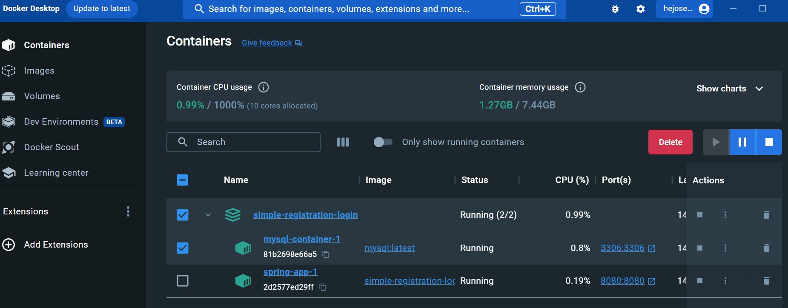
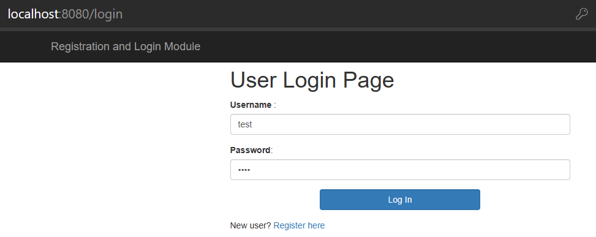
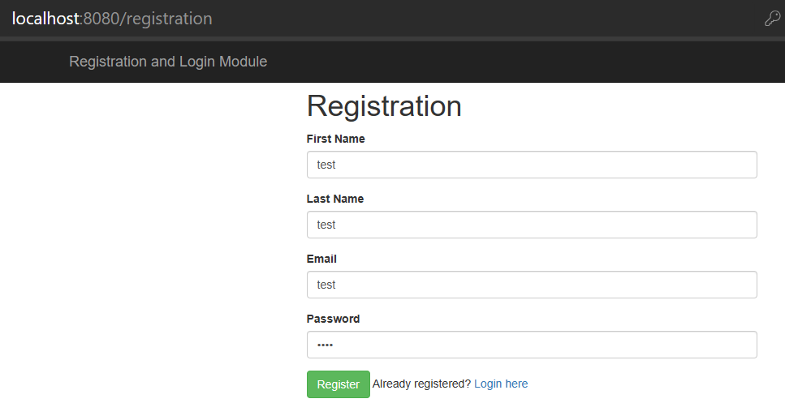
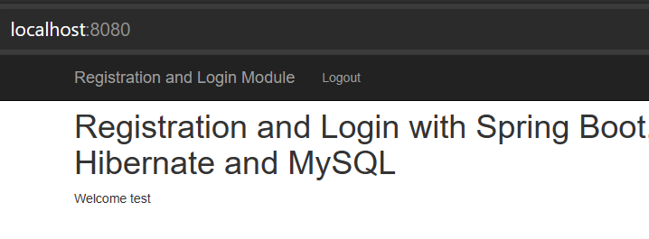

# Spring Security Login System
## Overview
This is a Java application that provides a secure user authentication and registration system using Spring Security. It utilizes the Spring Framework for managing user credentials, roles, and login functionality. The application uses a MySQL database to store user information, and Docker is employed for containerized deployment.

## Why Use This?
- Secure Authentication: Implements a robust authentication system using Spring Security, ensuring the confidentiality and integrity of user credentials.

- Role-Based Authorization: Supports role-based access control, allowing you to define different levels of access for users.

- Encrypted Passwords: Utilizes BCrypt password encoding to store passwords securely in the database.

- User Registration: Includes a user registration feature with the ability to store user details in the database.

# How to Run
## Prerequisites
- Docker
- Maven

## Steps
- Clone the repository:
```
git clone https://github.com/hejoseph/simple-registration-login.git
```
- Navigate to the project directory and build it:
```
cd simple-registration-login
mvn clean install
```
- Run the Docker Compose file:
```
docker-compose up --build
```
- This will start two containers: one for MySQL and another for the Spring application.




- Wait for the application to start, and the MySQL container to be healthy. You can check the logs for both containers.

Access the application in your browser:

- http://localhost:8080

## Usage
- Visit http://localhost:8080/registration to register a new user.
- Access http://localhost:8080/login to log in.
- After successful login, you can access the home page http://localhost:8080/.

## Demo
- Login page : 



- Registration page : 



- Home page :

